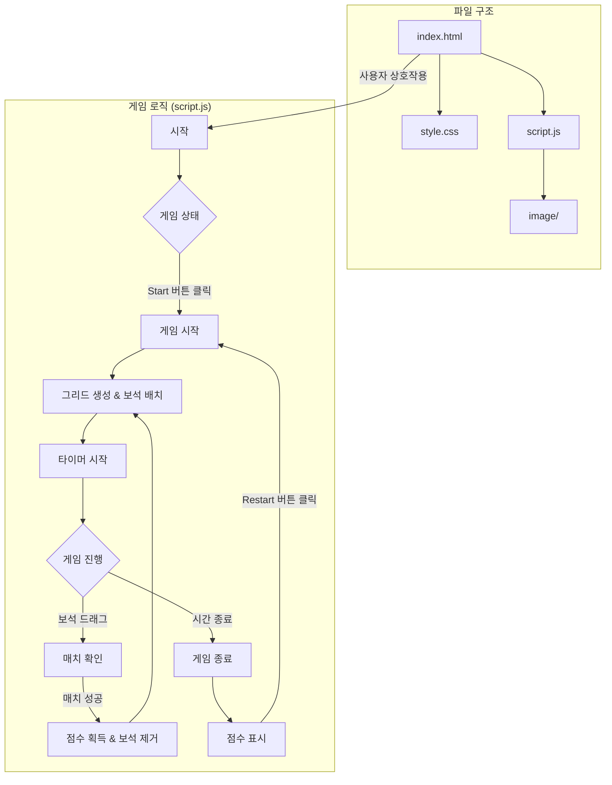

# 💎 신라 바이브 보석 게임 (Silla Vibe Jewel Game)

## 🎮 게임 설명

신라의 화려한 보석들을 배경으로 하는 매치-3 퍼즐 게임입니다. 제한 시간 내에 최대한 많은 보석을 맞춰 높은 점수를 획득하세요!

## 🕹️ 게임 방법

1.  **게임 시작** 
    *   'Start' 버튼을 눌러 게임을 시작합니다.

2.  **보석 맞추기**
    *   마우스를 사용하여 보석을 상,하,좌,우 1칸으로 드래그합니다.
    *   가로나 세로로 같은 종류의 보석이 3개 이상 나열되면 보석이 터지면서 점수를 얻습니다.
    *   가로나 세로로 4개를 나열하면 해당 줄이 전부 터집니다.
    *   가로나 세로로 5개를 나열하면 해당 줄을 포함하여 양옆 줄도 터집니다.
    *   가로, 세로를 3개씩 교차해서 (L자, T자 모양) 나열하면 각 가로, 세로 줄이 터집니다.
    *   교차해서 터트릴때 한 줄이 4개 이상이면 그 줄 포함 양옆 줄도 같이 터집니다.
3.  **시간**
    *   제한 시간은 60초입니다.
    *   시간이 다 되면 게임이 종료되고 최종 점수가 표시됩니다.

4.  **재시작** 
    *   'Restart' 버튼을 누르면 새 게임을 시작할 수 있습니다. 이전 게임의 점수가 '이전 점수' 판에 표시됩니다.

## ✨ 주요 기능

*   **점수 시스템:** 보석을 맞출 때마다 점수가 올라갑니다.
*   **타이머:** 60초 동안 게임이 진행됩니다.
*   **이전 점수 표시:** 게임이 끝나면 해당 판의 점수가 '이전 점수'로 기록되어 다음 게임 시작 시 확인할 수 있습니다.
*   **직관적인 드래그 앤 드롭:** 마우스로 쉽게 보석을 움직일 수 있습니다.

## 실행 주소
+ https://rufan-coder.github.io/silla_vibecoding_game/

## 발표 자료 주소
+ https://gamma.app/docs/-ot3a7ssc5tfpt2p

## 📊 게임 구조 (Mermaid)

---
재미있게 플레이해주셔서 감사합니다!
